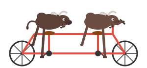

# BuffaloBuffalo

[](https://conacademy.github.io/BuffaloBuffalo/)

<p align="center">
  
  
</p>

A web application for constructing, visualizing, and interpreting [Buffalo sentences](https://en.wikipedia.org/wiki/Buffalo_buffalo_Buffalo_buffalo_buffalo_buffalo_Buffalo_buffalo) — the classic linguistic example demonstrating how a single word can function as multiple parts of speech.

## What is a Buffalo Sentence?

"Buffalo buffalo Buffalo buffalo buffalo buffalo Buffalo buffalo" is a grammatically correct sentence. It works because "buffalo" can be:
- A **proper noun** (the city in New York) — acts as an adjective
- A **noun** (the animal, bison)
- A **verb** (to intimidate or bully)

The famous sentence means: "Bison from Buffalo, NY, that bison from Buffalo, NY intimidate, themselves intimidate bison from Buffalo, NY."

## Quick Start

```bash
# Install dependencies
npm install

# Run the app
npm run dev
```

Then open http://localhost:5173 in your browser.

## Usage

### Building Sentences
- **Click** the colored buttons to add words to the end
- **Drag** buttons directly into the sentence bar at any position
- **Drag** words to reorder them within the sentence
- **Hover** over a word and click the **X** to remove it
- **Drag** a word off the sentence bar to remove it (with a poof!)

### Parts of Speech
- **Purple (Adjective)** = Buffalo (the city)
- **Green (Noun)** = buffalo (the animal)
- **Red (Verb)** = buffalo (to intimidate)
- **Golden Buffalo** = Wildcard that tries all three (limit: one per sentence)

### Viewing Parses
- Parse trees update **automatically** as you build
- Use **← Previous / Next →** to browse multiple valid parses
- Toggle between **Tree** and **Reed-Kellogg** diagram styles
- Invalid combinations show a helpful error message

## Scripts

```bash
npm run dev        # Start development server
npm run build      # Build for production
npm run preview    # Preview production build
npm run test       # Run tests in watch mode
npm run test:run   # Run tests once
npm run typecheck  # Check TypeScript types
```

## Features

- **Sentence Builder**: Click or drag to construct Buffalo sentences
- **Golden Buffalo Wildcard**: Mystery word that tries all parts of speech
- **Auto-Parsing**: Instant parse tree updates on every change
- **Earley Parser**: Handles ambiguous grammars, returns all valid parses
- **Tree Deduplication**: Filters out identical parse structures
- **Visualization**: SVG-based tree diagrams with two layout styles
- **Drag-and-Drop**: Intuitive reordering and removal with animations
- **Zero Dependencies**: Pure TypeScript, no runtime frameworks

## Tech Stack

- TypeScript (strict mode)
- Vite (build tooling)
- Vitest (52 tests passing)
- Vanilla JS (no UI framework)

## Project Structure

```
BuffaloBuffalo/
├── index.html           # Web app entry point
├── package.json
├── tsconfig.json
├── vite.config.ts
├── Taskfile.yml         # Task runner commands
├── src/
│   ├── index.ts         # Main exports
│   ├── types.ts         # Type definitions
│   ├── parser/
│   │   ├── lexicon.ts   # Word dictionary
│   │   ├── grammar.ts   # CFG rules
│   │   └── earley.ts    # Earley parser
│   └── viz/
│       ├── layout.ts    # Tree layout algorithms
│       └── renderer.ts  # SVG rendering
├── images/
│   ├── logo.svg         # Tandem bicycle logo
│   └── BuffaloBuffaloTandemBike.jpeg
├── README.md            # This file
├── AGENTS.md            # Agent documentation
├── MEMORY.md            # Technical decisions
└── PLAN.md              # Implementation plan
```

## Linguistic Notes

The app only allows the three linguistically valid parts of speech for "buffalo":

| Button | POS | Meaning |
|--------|-----|---------|
| Adjective (purple) | Proper Noun (PN) | Buffalo, NY — modifies the following noun |
| Noun (green) | Noun (N) | The animal (bison) |
| Verb (red) | Verb (V) | To intimidate, bully, or bewilder |

**Note:** "Buffalo" is never an adverb or conjunction in English — those were considered but rejected for linguistic accuracy.

## Inspiration

Inspired by Professor Stephen Pinker's demonstration in MIT's 9.01 course, showing how syntax and semantics interact in natural language.
